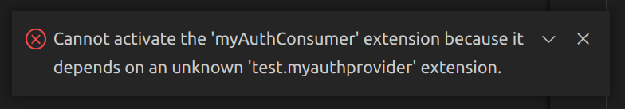

# What I want to achieve

I want to be able to do the following after freshly cloning the repo:

1. Run: `npm i` to install dependencies
2. Use the hotkey `fn`+`f5` to launch `myauthconsumer` with the config in `.vscode/launch.json`.
3. Run the `hello world` command in the debug session

## What currently goes wrong

`code` errors out on step 3 with the following modal dialogues and popup error. In short; it is expecting the `test.myauthprovider` extension to exist in the workspace, but it does not.




## Desired solution

I want a way of having the `test.myauthprovider` extension temporarily loaded into the window  for `test.myauthconsumer`. 

## Attempted Solutions

### 1. `--extensions-dir`

Previously I had solved this by building `test.myauthprovider`; installing it into a `tmp-extensions` folder using the command

```
code --install-extension=./extensions/myauthprovider/myauthprovider-0.0.1.vsix --extensions-dir=./tmp-extensions
```

and then setting `--extensions-dir=./tmp-extensions` in the args of the `launch.json`. However as discussed in https://github.com/microsoft/vscode/issues/169734 this was never actually a feature of `code`.

### 2. Creating a profile with the extension `test.myauthprovider` installed

I have tried doing this using the method in https://github.com/microsoft/vscode/issues/170932. I have also tried to do this by generating the profile on install using the command

```
code --profile=myProviderProfile --install-extension=./extensions/myauthprovider/myauthprovider-0.0.1.vsix
```

and then launching `myauthconsumer` with `myProviderProfile`; however the extension does not appear to be installed in the profile when I do this.
